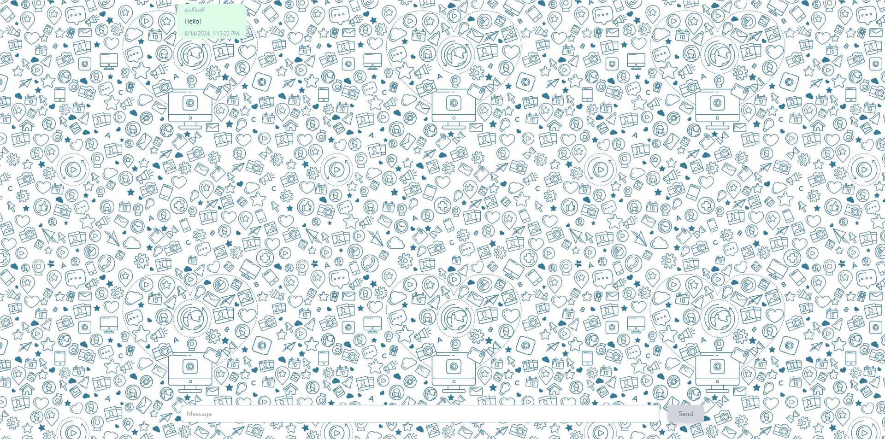

This is a Live chat app using Next.js and Pusher Api.

## Getting Started

First, run the development server:

```bash
npm run dev
# or
yarn dev
# or
pnpm dev
# or
bun dev
```


Open [http://localhost:3000](http://localhost:3000) with your browser to see the result.

First Input user info to start chat


This project Does not verify user info and just use name as sender

Start chat 



## Learn More

You need your Pusher app api and replace env file

To learn more about Next.js, take a look at the following resources:

- [Pusher Channel](https://pusher.com/docs/channels/) - learn about Pusher features and API.
- [Learn Next.js](https://nextjs.org/learn) - an interactive Next.js tutorial.

